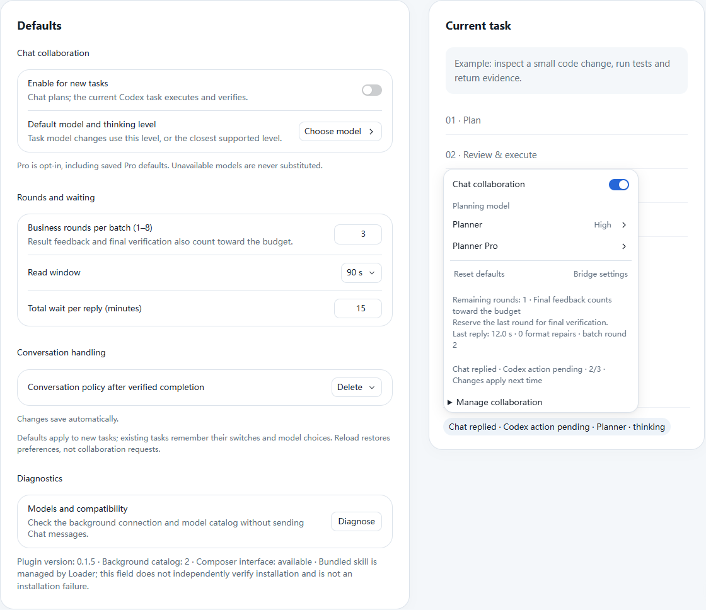

# Bridge

**Let Chat plan. Let Codex review, execute, and bring back evidence.**

[](https://github.com/JHees/chatgpt-codex-bridge/actions/workflows/ci.yml)
[](docs/RELEASE-0.1.5.md)
[](LICENSE)

English · [简体中文](README.zh-CN.md)

Bridge is a Windows [Codex Script Loader](https://github.com/JHees/codex-script-loader) plugin that connects a Chat model to your current Codex task. Choose a capable Chat planner—including an explicitly selected Pro model—and keep a fast Codex model for local code changes, tests, and verification. Plans and results travel between them automatically.

[Quick start](#quick-start) · [How it works](#how-it-works) · [Recovery](#automatic-recovery) · [Documentation](#documentation)

## Preview



*Actual Bridge components rendered in an isolated preview. Model names, task content, and timing values are anonymous examples, not performance measurements or a screenshot of a personal workspace.*

## Highlights

- **Independent models.** Select Chat's model and thinking level without changing the Codex executor. Available choices come from your account's native catalog.
- **Automatic feedback.** Chat proposes bounded steps; Codex reviews the instructions, performs approved work, and reports real evidence for the next decision.
- **Background operation.** Keep working in the current task. Bridge uses the App-owned Chat client without typing into a Chat window.
- **Startup recovery.** Waits for App services to become available, retries failed connections with backoff, and reconnects an invalid idle client.
- **Visible control.** Editable submission instructions, remaining rounds, last-reply timing, and explicit pause/end controls.
- **One package.** Renderer, `bridge-chat` skill, and PowerShell helper install and update together.

## Quick start

### Requirements

- Windows with the Codex desktop app, signed in to an account with Chat access.
- Native **Codex Script Loader 0.5.12+** for the complete UI experience.
- PowerShell 7 for the bundled helper. Node.js is needed only for development.

### Install

1. Download a packaged `bridge-<version>.zip` from [Releases](https://github.com/JHees/chatgpt-codex-bridge/releases). Use the plugin ZIP, not GitHub's source archive.
2. Install it through Loader's plugin manager and enable Bridge. The bundled skill is installed with it.
3. Open **Bridge settings** and select a Chat model and thinking level. Defaults save automatically.
4. Enable collaboration in the current task control, review the visible instructions, and send your request normally.

Example request:

> Review this module, propose the smallest fix, then guide Codex through implementation and tests. Codex should review each proposed action before executing it and report the evidence back.

After the native submission is accepted, Codex connects to the selected Chat. Turning the switch on alone does not start a Chat request.

## How it works

```text
Your request
    ↓
Chat: decide the next step and acceptance criteria
    ↓
Codex: review scope and permissions → execute → collect evidence
    ↓
Chat: inspect the results → revise or confirm completion
```

Bridge uses three operations: `status`, `exchange`, and `finish`. A dedicated Chat stays bound to the originating task; repeated reads continue the same message instead of resending it. A planner's completion claim is checked against the executor's reported evidence before normal cleanup.

Chat does not acquire direct local-file or shell access through Bridge. Codex reads the requested files and returns the relevant evidence. Chat instructions remain subject to the executor's review and existing permissions.

## Defaults and controls

| Setting | Default | Behavior |
| --- | --- | --- |
| Collaboration | Off | Enable per task; preferences persist |
| Chat model | Not selected | Select explicitly; no automatic model substitution |
| Business rounds | 3 | Range 1–8; feedback and final verification count |
| Read window | 90 seconds | Short reads continue without a new send |
| Total reply wait | 15 minutes | Range 1–60 minutes; expiry pauses for consent |
| Verified completion | Delete Chat | Retain or archive can be selected |

The task menu shows remaining rounds and the last validated reply's duration and format-repair count. Duration includes waiting and pauses; it is not a model speed benchmark. Pro is used only when explicitly selected or inherited from a saved Pro preference.

## Automatic recovery

Version 0.1.5 fixes one-shot startup discovery: an App that is still mounting no longer leaves Bridge disconnected until a manual reload.

- Failed connection attempts retry after **1, 2, 5, 10, 30, then 60 seconds**, with later retries capped at 60 seconds.
- Each discovery/catalog attempt has a **15-second timeout**. A healthy idle client is checked every **30 seconds**.
- Partial UI startup is cleaned up before retrying. Concurrent manual and automatic checks share one connection attempt.
- **An active session is preserved.** Recovery is deferred while it is owned, including an unresolved or failed session. Bridge never restarts that conversation or replays a message automatically.
- Disabling or unloading the plugin cancels its recovery timers. A timed-out or stopped attempt cannot overwrite a newer connection.

If an active conversation loses its native client, inspect its error and end or retain it explicitly; idle reconnection can then proceed. Use **Diagnose** to request an immediate idle check. Unsupported App internals may still require a plugin update.

## Boundaries

- One active collaboration per plugin instance. This release targets the native Windows Loader.
- App Chat services are internal interfaces and can change with App updates.
- Budget, deadline, and user-input pauses require explicit continuation. Recovery does not bypass them.
- Reload restores preferences, not active sessions or message history. Saved draft instructions are preserved; use **Prepare fresh collaboration instructions** if they belong to an old instance.
- Uncertain sends are not retried. Automatic deletion requires completion evidence, planner confirmation, and native ownership checks.
- This project does not promise quota savings, faster completion, or equal behavior across all models. Pro quality and long unattended coding runs need separate evaluation.

## Documentation

- [0.1.5 release notes](docs/RELEASE-0.1.5.md)
- [Detailed usage / 详细使用说明](docs/USAGE.md)
- [Architecture](docs/ARCHITECTURE.md)
- [Protocol and helper](skills/bridge-chat/references/protocol.md)
- [Security model](docs/SECURITY_MODEL.md)
- [Troubleshooting](docs/TROUBLESHOOTING.md)
- [Build and release](docs/RELEASING.md)

## Development

Use Node.js 22.12+ and PowerShell 7:

```powershell
npm ci
npm run check
```

`check` runs type checking, lint, tests, build, and ZIP validation. Packages are written to `dist/`; building does not install them. Tests cover delayed startup, connection timeouts, idle reconnection, cleanup of partial registrations, active-session protection, protocol handling, and UI behavior. Simulated recovery tests do not replace a full cold-start test of a particular installed App build.

For a useful bug report, include App/Loader/Bridge versions, the stable diagnostic error code, reproduction steps, and whether a session was active. Remove private prompts, credentials, task IDs, and local paths before sharing logs or screenshots.

Contributions are welcome. Keep changes inside the generic Loader plugin interface, include a focused regression for behavior changes, and run `npm run check` before opening a pull request.

## License

[MIT](LICENSE). Third-party notices are included with the plugin package.
