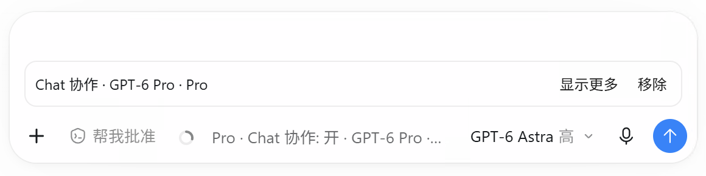

# Bridge

**Chat 负责规划，Codex 动手实现，Bridge 让两端自动协作。**

[English](README.md) · 简体中文

Bridge 是一个 [Codex Script Loader](https://github.com/JHees/codex-script-loader) 插件，将 Chat 规划模型接入当前 Codex 任务。你可以让 Chat Pro 等推理模型负责方案设计，搭配快速 Codex 模型完成代码编写、问题修复和代码审查。

## 解决什么问题？

使用两个模型协作时，往往需要自己来回复制需求、代码和测试结果，再把建议交给执行端。Bridge 自动完成这些沟通。

Chat 拆解任务、提出方案并复核结果；Codex 审核具体操作、修改本地文件、运行命令和测试，再把结果交回 Chat。你只需在当前任务中提出目标，并随时补充要求。

## 项目亮点

- **模型自由搭配**：独立选择 Chat 模型与思考程度，保留你习惯的 Codex 执行模型。
- **两端自动沟通**：计划、进展和测试结果自动往返，无须手动复制消息。
- **围绕任务持续推进**：Chat 根据执行结果调整下一步，指导修改、测试和验收。
- **融入现有工作流**：从 Codex 输入区开启协作，整个过程留在当前任务中。

## 开始使用

需要 Windows、可使用 Chat 的 Codex 桌面应用、**Codex Script Loader 0.5.12+** 和 **PowerShell 7**。

1. 从 [Releases](https://github.com/JHees/chatgpt-codex-bridge/releases) 下载 `bridge-<版本>.zip`，在 Loader 中安装并启用。
2. 从 Codex 输入区打开 Bridge，选择 Chat 模型与思考程度，开启协作。
3. 保留 Bridge 附带的协作说明，正常发送需求。

例如：

> 修复这个问题。让 Chat 分析方案，指导 Codex 修改代码并运行测试，再根据结果确认修复是否完成。

[使用指南](docs/USAGE.md) · [故障排查](docs/TROUBLESHOOTING.md) · [反馈问题](https://github.com/JHees/chatgpt-codex-bridge/issues)

## 许可证

[MIT](LICENSE)。
