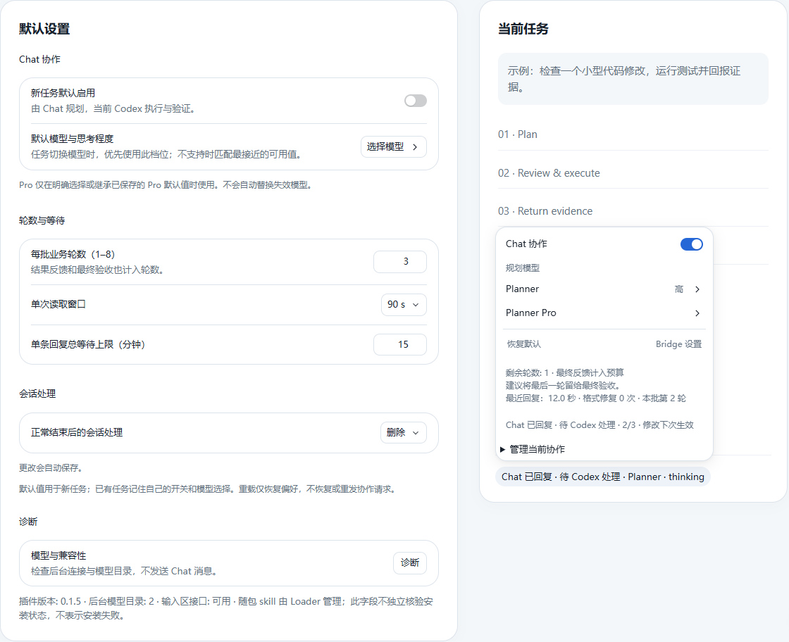

# Bridge

**让 Chat 规划，让 Codex 审核、执行并回传证据。**

[](https://github.com/JHees/chatgpt-codex-bridge/actions/workflows/ci.yml)
[](docs/RELEASE-0.1.5.md)
[](LICENSE)

[English](README.md) · 简体中文

Bridge 是一个 Windows [Codex Script Loader](https://github.com/JHees/codex-script-loader) 插件，把 Chat 模型与当前 Codex 任务连接起来。你可以选择擅长规划的 Chat 模型，包括明确选择的 Pro，同时用快速 Codex 模型完成本地代码修改、测试和验证。两端自动交换计划与执行结果。

[快速开始](#快速开始) · [工作方式](#工作方式) · [自动恢复](#自动恢复) · [文档](#文档)

## 功能预览



*在独立预览环境中渲染的真实 Bridge 组件。模型名称、任务内容和耗时均为匿名示例数据，不是性能测量，也不是个人工作区截图。*

## 主要功能

- **模型独立选择**：设置 Chat 模型与思考程度，保留当前 Codex 执行模型。可选项来自当前账户的原生模型目录。
- **自动反馈循环**：Chat 提出有明确范围的步骤；Codex 审核后执行，回传真实证据，再由 Chat 决定下一步。
- **后台协作**：继续停留在当前任务，通过 App 自有 Chat 客户端收发，不向聊天输入框模拟打字。
- **启动恢复**：等待 App 服务就绪，连接失败时退避重试，空闲客户端失效时重新连接。
- **可见控制**：可编辑的提交说明、剩余轮数、最近回复统计，以及明确的暂停和结束操作。
- **单包安装**：renderer、`bridge-chat` skill 和 PowerShell helper 一起安装、更新与回滚。

## 快速开始

### 环境要求

- Windows、Codex 桌面应用，以及可以使用 Chat 的已登录账户。
- 原生 **Codex Script Loader 0.5.12+**，提供完整界面体验。
- PowerShell 7，用于随包 helper；只有开发时才需要 Node.js。

### 安装

1. 从 [Releases](https://github.com/JHees/chatgpt-codex-bridge/releases) 下载 `bridge-<版本>.zip` 插件包，不要使用 GitHub 自动生成的源码压缩包。
2. 通过 Loader 插件管理器安装并启用 Bridge，随包 skill 会一起安装。
3. 打开 **Bridge 设置**，选择 Chat 模型与思考程度；设置自动保存。
4. 在当前任务控制中开启协作，检查可见说明，然后正常发送请求。

请求示例：

> 审查这个模块，提出最小修复方案，然后指导 Codex 修改并运行测试。Codex 需要先审核每项建议，再执行并回传证据。

只有原生提交被接受后，Codex 才会连接所选 Chat。打开开关本身不会发送 Chat 请求。

## 工作方式

```text
用户请求
    ↓
Chat：决定下一步及验收标准
    ↓
Codex：审核范围与权限 → 执行 → 收集证据
    ↓
Chat：审阅结果 → 调整方案或确认完成
```

Bridge 仅提供 `status`、`exchange`、`finish` 三个操作。专用 Chat 始终绑定原任务；重复读取会继续同一条消息，不会重发。正常清理前，规划端的完成建议还需要执行端提供实际验收证据。

Chat 不会通过 Bridge 获得直接读取本地文件或运行 shell 的能力。具体文件由 Codex 读取并回传，Chat 的建议仍受执行端审核和现有权限约束。

## 默认值与控制

| 设置 | 默认值 | 行为 |
| --- | --- | --- |
| 协作 | 关闭 | 按任务开启，保存偏好 |
| Chat 模型 | 未选择 | 明确选择，不自动替换模型 |
| 每批业务轮数 | 3 | 范围 1–8，反馈和最终验收也计入 |
| 单次读取窗口 | 90 秒 | 分段读取，不新增发送 |
| 单条回复总等待 | 15 分钟 | 范围 1–60 分钟，到期暂停并等待确认 |
| 验收完成后 | 删除 Chat | 可改为保留或归档 |

任务菜单显示剩余轮数、最近一次有效回复耗时和格式修复次数。耗时包含等待及暂停，不是模型速度基准。只有明确选择 Pro，或继承已保存的 Pro 偏好时，才会使用 Pro。

## 自动恢复

0.1.5 修复了一次性启动发现的问题：App 尚未完成挂载时，Bridge 不再一直断开到用户手动重载。

- 连接失败后按 **1、2、5、10、30、60 秒**退避重试，后续间隔封顶为 60 秒。
- 每次服务发现与模型目录读取合计最多等待 **15 秒**；健康的空闲连接每 **30 秒**检查一次。
- 界面只注册了一部分就失败时，先清理本次注册再重试；手动诊断与自动恢复共用同一次连接尝试。
- **保留活动会话**：只要仍有归属明确的会话，包括尚未处理或已失败的会话，恢复会延后。不会自动重建该会话或重放消息。
- 禁用或卸载插件会清理恢复计时器；超时或已停止的旧尝试不能覆盖新连接。

活动会话丢失原生客户端时，请查看错误并明确结束或保留该会话，随后空闲恢复才能继续。可以通过 **诊断**立即发起一次空闲连接检查。App 内部接口发生不兼容变化时，仍可能需要升级插件。

## 使用边界

- 每个插件实例只允许一个活动协作。本版本面向原生 Windows Loader。
- App Chat 是内部接口，可能随 App 升级改变。
- 轮数、等待期限和用户输入暂停需要明确继续；自动恢复不绕过这些条件。
- 重载恢复偏好，不恢复活动会话或消息历史。旧草稿说明会保留；需要再次协作时使用 **重新准备协作说明**。
- 不确定是否发送成功时不自动重试。自动删除需要完成证据、Chat 确认及原生所有权核验。
- 本项目不承诺节省多少额度、提升多少速度或所有模型行为一致；Pro 质量和长期无人值守代码任务需要单独评估。

## 文档

- [0.1.5 更新说明](docs/RELEASE-0.1.5.md)
- [详细使用说明](docs/USAGE.md)
- [架构](docs/ARCHITECTURE.md)
- [协议与 helper](skills/bridge-chat/references/protocol.md)
- [安全边界](docs/SECURITY_MODEL.md)
- [故障排查](docs/TROUBLESHOOTING.md)
- [构建与发布](docs/RELEASING.md)

## 开发

使用 Node.js 22.12+ 和 PowerShell 7：

```powershell
npm ci
npm run check
```

`check` 包含类型检查、lint、测试、构建和 ZIP 校验。产物位于 `dist/`，构建不会自动安装。测试覆盖延迟启动、连接超时、空闲重连、部分注册清理、活动会话保护、协议和界面行为。模拟恢复测试不等同于特定 App 安装版本的完整冷启动实测。

报告问题时，请提供 App、Loader、Bridge 版本，稳定错误码、复现步骤，以及当时是否有活动会话。分享日志或截图前，移除私人提示词、凭据、任务 ID 和本地路径。

欢迎贡献。请通过通用 Loader 插件接口实现功能，为行为变化提供针对性回归测试，并在提交 PR 前运行 `npm run check`。

## 许可证

[MIT](LICENSE)。第三方许可说明随插件包提供。
